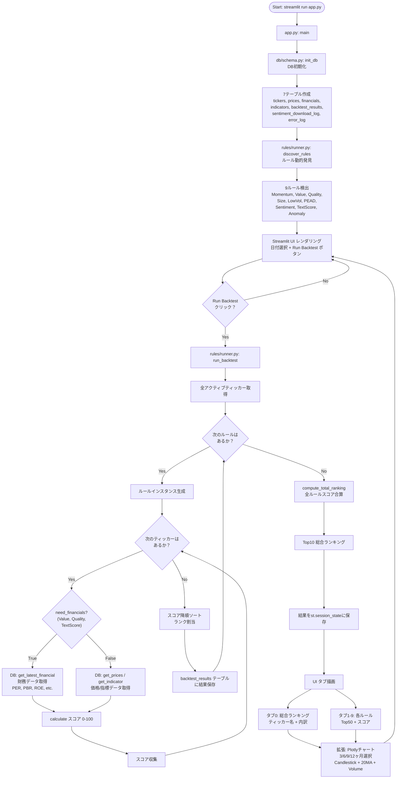

# 1. フローチャート — システム全体の処理フロー (stockChecker)

```mermaid
flowchart TD
    A(["Start: streamlit run app.py"]) --> B[app.py: main]
    B --> C[db/schema.py: init_db<br>DB初期化]
    C --> C1[7テーブル作成<br>tickers, prices, financials,<br>indicators, backtest_results,<br>sentiment_download_log, error_log]
    C1 --> D[rules/runner.py: discover_rules<br>ルール動的発見]
    D --> D1[9ルール検出<br>Momentum, Value, Quality,<br>Size, LowVol, PEAD,<br>Sentiment, TextScore, Anomaly]
    D1 --> E[Streamlit UI レンダリング<br>日付選択 + Run Backtest ボタン]
    E --> F{"Run Backtest<br>クリック？"}
    F -->|No| E
    F -->|Yes| G[rules/runner.py: run_backtest]

    G --> H[全アクティブティッカー取得]
    H --> I{"次のルールは<br>あるか？"}
    I -->|Yes| J[ルールインスタンス生成]
    J --> K{"次のティッカーは<br>あるか？"}
    K -->|Yes| L{"need_financials?<br>(Value, Quality,<br>TextScore)"}

    L -->|True| M[DB: get_latest_financial<br>財務データ取得<br>PER, PBR, ROE, etc.]
    L -->|False| N[DB: get_prices / get_indicator<br>価格/指標データ取得]

    M --> O[calculate スコア 0-100]
    N --> O

    O --> P[スコア収集]
    P --> K

    K -->|No| Q[スコア降順ソート<br>ランク割当]
    Q --> R[backtest_results テーブル<br>に結果保存]
    R --> I

    I -->|No| S[compute_total_ranking<br>全ルールスコア合算]
    S --> T[Top10 総合ランキング]
    T --> U[結果をst.session_stateに保存]
    U --> V[UI タブ描画]
    V --> V1[タブ0: 総合ランキング<br>ティッカー名 + 内訳]
    V --> V2[タブ1-9: 各ルール<br>Top50 + スコア]
    V1 --> W["拡張: Plotlyチャート<br>3/6/9/12ヶ月選択<br>Candlestick + 20MA + Volume"]
    V2 --> W
    W --> E
```
