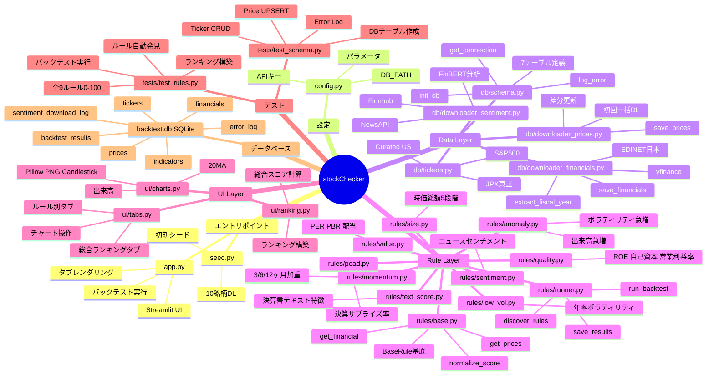

# stockChecker アーキテクチャマインドマップ

## 凡例

| レイヤー | 役割 |
|----------|------|
| **エントリポイント** | アプリケーション起動・初期化 |
| **設定** | 環境変数による全パラメータ管理 |
| **Data Layer** | DB接続・スキーマ・データ取得（株価・財務・センチメント） |
| **Rule Layer** | プラグイン方式の9つの定量ルール + 実行エンジン |
| **UI Layer** | Streamlitによる可視化（タブ・チャート・ランキング） |
| **テスト** | pytest による自動テスト |
| **データベース** | SQLite 7テーブルによる永続化 |
