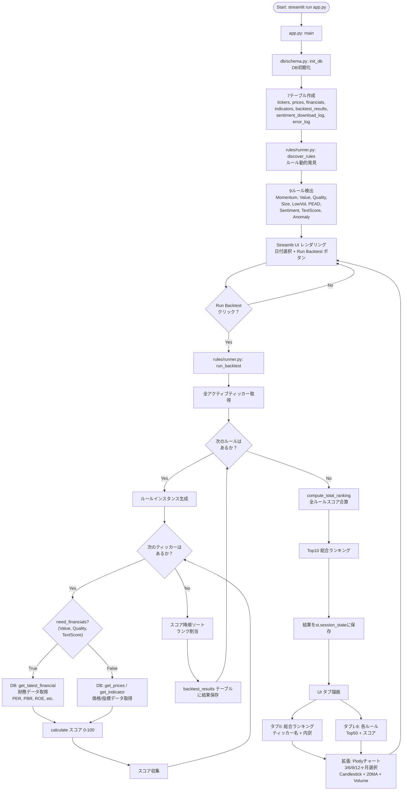
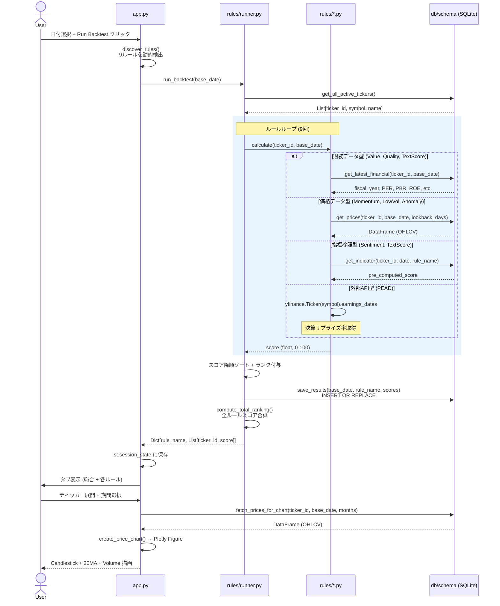
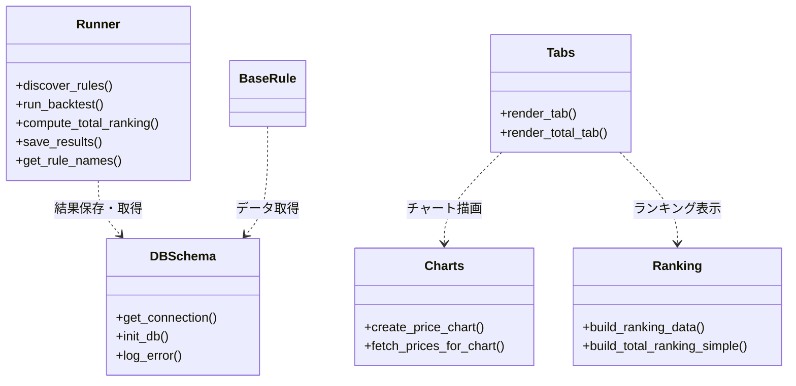
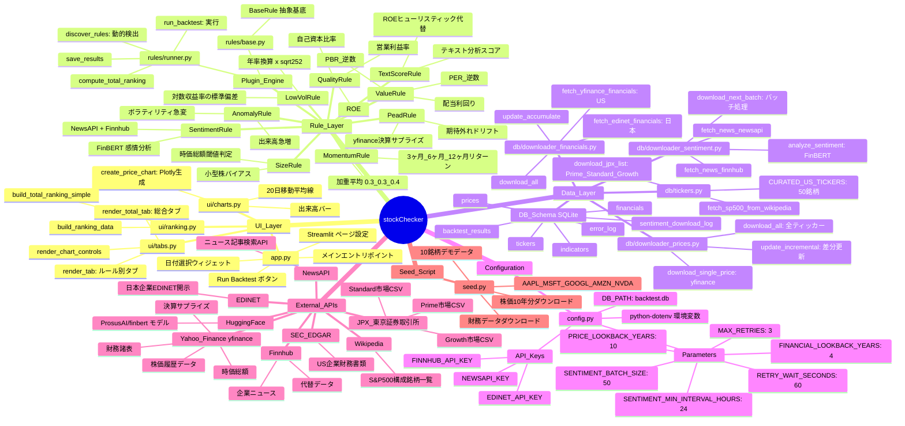
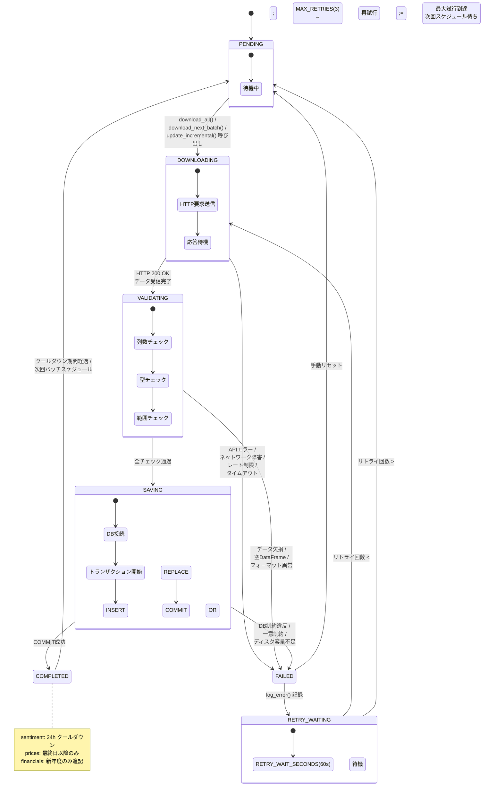

# stockChecker 図解集

## 1. フローチャート — システム全体の処理フロー

---

## 2. シーケンス図 — バックテスト実行のモジュール間通信

---

## 3a. クラス図 — ルール継承階層（詳細）

`BaseRule`（抽象基底）と9つの具象ルールの完全なメソッドシグネチャ。A4横置き印刷に最適化。

```mermaid
classDiagram
    class BaseRule {
        <<abstract>>
        +need_financials() bool*
        +calculate(ticker_id, base_date) float*
        +get_prices(ticker_id, base_date, lookback_days) DataFrame
        +get_financial(ticker_id, fiscal_year) dict
        +get_latest_financial(ticker_id, base_date) dict
        +get_indicator(ticker_id, date, rule_name) float
    }

    class MomentumRule {
        +need_financials() bool : False
        +calculate(ticker_id, base_date) float
        -calc_momentum_3m(prices) float
        -calc_momentum_6m(prices) float
        -calc_momentum_12m(prices) float
    }

    class ValueRule {
        +need_financials() bool : True
        +calculate(ticker_id, base_date) float
        -score_PER(per) float
        -score_PBR(pbr) float
        -score_div_yield(dy) float
    }

    class QualityRule {
        +need_financials() bool : True
        +calculate(ticker_id, base_date) float
        -score_ROE(roe) float
        -score_equity_ratio(ratio) float
        -score_op_margin(margin) float
    }

    class SizeRule {
        +need_financials() bool : False
        +calculate(ticker_id, base_date) float
    }

    class LowVolRule {
        +need_financials() bool : False
        +calculate(ticker_id, base_date) float
        -calc_volatility(prices) float
    }

    class PeadRule {
        +need_financials() bool : False
        +calculate(ticker_id, base_date) float
        -fetch_earnings_data(symbol) dict
    }

    class SentimentRule {
        +need_financials() bool : False
        +calculate(ticker_id, base_date) float
    }

    class TextScoreRule {
        +need_financials() bool : True
        +calculate(ticker_id, base_date) float
    }

    class AnomalyRule {
        +need_financials() bool : False
        +calculate(ticker_id, base_date) float
        -calc_volume_ratio(prices) float
        -calc_volatility_ratio(prices) float
    }

    BaseRule <|-- MomentumRule
    BaseRule <|-- ValueRule
    BaseRule <|-- QualityRule
    BaseRule <|-- SizeRule
    BaseRule <|-- LowVolRule
    BaseRule <|-- PeadRule
    BaseRule <|-- SentimentRule
    BaseRule <|-- TextScoreRule
    BaseRule <|-- AnomalyRule
```

## 3b. クラス図 — モジュール構造

主要モジュール（Runner, DBSchema, Ranking, Charts, Tabs）の依存関係。

---

## 4. マインドマップ — システム概念の階層整理

---

## 5. 状態遷移図 — データダウンロードのライフサイクル

