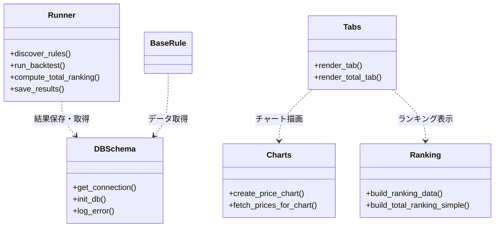
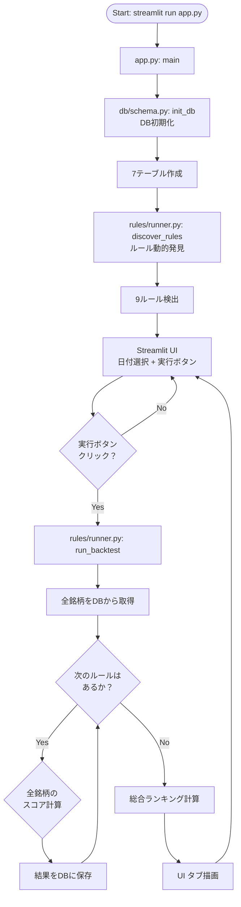
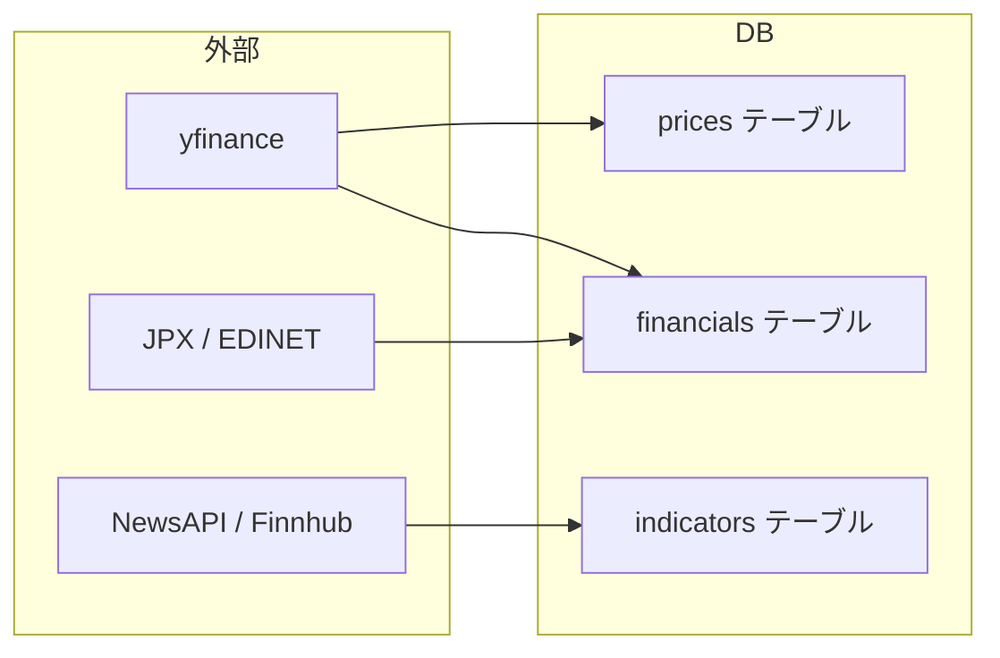
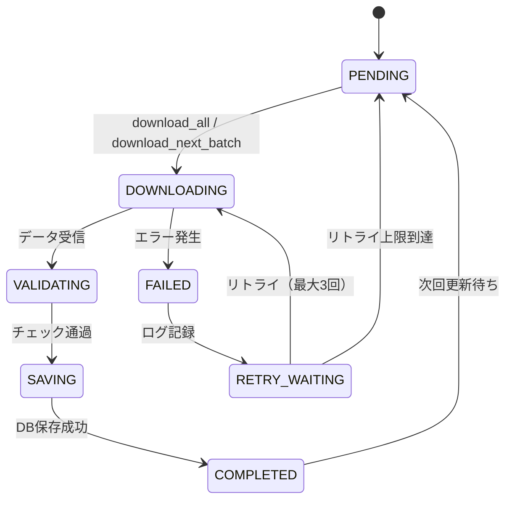
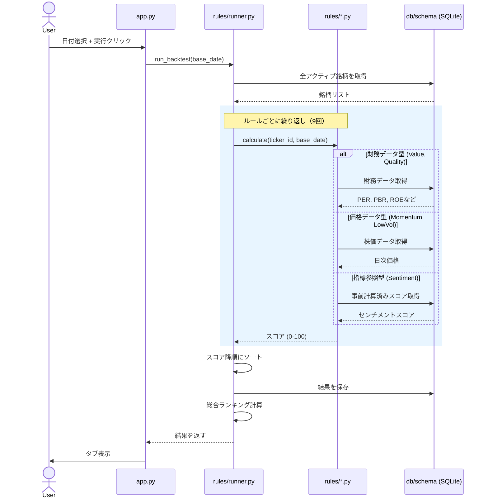

# Beginner Overview — stockChecker 初心者向け解説

このドキュメントは、`stockChecker` プロジェクトを初めて読むプログラミング初心者のために書かれています。

---

## 1. プロジェクト全体構造と役割

### 1.1 このプロジェクトは何をするのか

**stockChecker** は、資産運用・株式投資の世界で「こういう条件の株は値上がりしやすい」という法則（＝投資ルール）を、過去の株価データを使って検証するためのツールです。

- 株価・財務・ニュースを自動収集
- 9 種類の法則で銘柄を 0〜100 点でスコアリング
- ブラウザ上で結果をランキング表示

### 1.2 フォルダ構成

```
stockChecker/
├── SYSTEM_OVERVIEW.md       ← このプロジェクトの入門書（最初に読む）
├── docs/                    ← 詳細ドキュメント（設計・運用・テスト）
├── app.py                   ← 起動ファイル（ここから始まる）
├── config.py                ← 設定情報（DBの場所やAPIキー）
├── seed.py                  ← お試し用：10銘柄だけデータを入れる
├── requirements.txt         ← 必要なライブラリ一覧
├── backtest.db              ← データを保存するファイル（SQLite）
│
├── db/                      ← データベース関連
│   ├── schema.py            ←   DBの設計図（テーブル定義）
│   ├── tickers.py           ←   銘柄リストを取得
│   ├── downloader_prices.py ←   株価をダウンロード
│   ├── downloader_financials.py ← 財務データをダウンロード
│   └── downloader_sentiment.py  ← ニュースをダウンロード
│
├── rules/                   ← 投資ルール（9個の判定ロジック）
│   ├── base.py              ←   ルールのひな型（親クラス）
│   ├── runner.py            ←   全ルールを実行するエンジン
│   ├── momentum.py          ←   モメンタム（上がってる株）
│   ├── value.py             ←   バリュー（割安株）
│   ├── quality.py           ←   クオリティ（質の良い株）
│   ├── size.py              ←   サイズ（小型株）
│   ├── low_vol.py           ←   低ボラティリティ（安定株）
│   ├── pead.py              ←   PEAD（決算サプライズ）
│   ├── sentiment.py         ←   センチメント（ニュース感情）
│   ├── text_score.py        ←   テキスト特徴（決算書の文章）
│   └── anomaly.py           ←   異常検知（出来高急増）
│
├── ui/                      ← 画面表示
│   ├── tabs.py              ←   タブの描画
│   ├── charts.py            ←   株価チャート
│   └── ranking.py           ←   ランキング集計
│
├── tests/                   ← 自動テスト
│   ├── test_schema.py
│   └── test_rules.py
│
├── diagrams/                ← 図の元データ（Mermaid形式）
└── py_source_export/        ← ソースコード出力ツール
```

### 1.3 各フォルダの担当

| フォルダ | 役割 | たとえると… |
|---------|------|------------|
| `db/` | データの保存・取得 | 書類棚とファイル係 |
| `rules/` | スコア計算ロジック | 審査員（9人） |
| `ui/` | 画面表示 | 掲示板・ランキングボード |
| `tests/` | 品質保証 | 検品係 |
| `docs/` | 設計書・説明書 | マニュアル |

### 1.4 主要ファイルの役割

| ファイル | 担当 | 重要なポイント |
|---------|------|--------------|
| **app.py** | 起動＆画面の枠組み | このファイルを実行するとブラウザが開く |
| **config.py** | 設定の一元管理 | 環境変数（.env）から値を読み込む |
| **seed.py** | お試しデータ投入 | 10銘柄だけ先にダウンロードして動作確認 |
| **rules/base.py** | 全ルールのひな型 | ここを継承して新しいルールを作る |
| **rules/runner.py** | ルール実行エンジン | 全ルールを自動で見つけて順に実行 |
| **db/schema.py** | DBの設計図 | 7つのテーブルを定義 |

---

## 2. モジュール間の依存関係

### 2.1 依存関係の全体像



### 2.2 依存の方向性

stockChecker では **「UI → Rules → DB」** の一方通行で依存します。

```
app.py
  ├── rules/runner.py    （ルール実行を依頼）
  │     └── rules/*.py   （各ルール）
  │           └── db/schema.py  （データ取得）
  ├── ui/tabs.py         （画面表示を依頼）
  │     ├── ui/charts.py （チャート描画）
  │     └── ui/ranking.py（ランキング集計）
  └── db/schema.py       （DB初期化）
```

**「一方通行」が重要な理由**: `db/` が `ui/` や `rules/` を参照することはありません。これによって「データベースのコードを変えても画面に影響が出ない」という独立性が保たれます。

### 2.3 `import` のしくみ — なぜドット区切りで書くのか

```python
# app.py の先頭（実コード）
from db.schema import init_db
from rules.runner import discover_rules, run_backtest
from ui.tabs import render_tab, render_total_tab
```

**読み方のコツ**:
- `from db.schema import init_db`
  - 「`db` フォルダの中の `schema.py` から、`init_db` という関数を借りてくる」
- ドット `.` は階層の区切り。`db/schema.py` を `db.schema` と書く。

### 2.4 呼び出しの流れ（具体例）

```python
# app.py:45  （ルールを自動発見）
rules = discover_rules()         # → rules/runner.py の関数を呼ぶ

# app.py:73  （バックテスト実行）
results = run_backtest(base_date_str)  # → rules/runner.py の関数を呼ぶ

# app.py:90  （画面表示）
render_total_tab(total_results, ...)   # → ui/tabs.py の関数を呼ぶ
```

---

## 3. データの流れ（3つのフェーズ）

stockChecker のデータは **「集める → 採点する → 表示する」** の 3 段階で流れます。

### 3.1 全体フロー



### 3.2 フェーズ1: データ収集（外部 → DB）

**3 系統のデータ** をダウンロードして SQLite に保存します。



| データ | 取得元 | 保存先テーブル | 更新方法 |
|-------|--------|--------------|---------|
| 株価（日次） | yfinance | `prices` | 初回全期間、以降は差分のみ |
| 財務（年次） | yfinance / edinet | `financials` | 蓄積（古いデータを消さず追加） |
| センチメント（ニュース） | NewsAPI / Finnhub + FinBERT | `indicators` | 50銘柄ずつ順次処理 |

**ダウンロードのライフサイクル**:



### 3.3 フェーズ2: バックテスト（DB → スコア）

ユーザーが基準日を選んで「実行」ボタンを押すと、以下の処理が動きます。



**データベースのテーブル構成**:

```
tickers（銘柄マスタ）
  │
  ├── prices（日次株価）          ← ticker_id で紐づく
  ├── financials（年次財務）      ← ticker_id で紐づく
  ├── indicators（計算済指標）    ← ticker_id で紐づく
  │
  └── backtest_results（バックテスト結果）
        └── どの銘柄が、どのルールで、何点だったか
```

### 3.4 フェーズ3: 可視化（スコア → 画面）

計算されたスコアは **Streamlit** というライブラリを使ってブラウザに表示されます。

**画面の構成**:
```
[基準日: YYYY-MM-DD ▼]  [バックテスト実行]

[総合ランキング] [モメンタム] [バリュー] ... [異常検知]
  ┌─────────────────────────────────────┐
  │ # │ 銘柄名 │ スコア │ グラフ       │
  │ ──┼────────┼────────┼───────       │
  │ 1 │ AAPL   │ 89    │ [📈 6ヶ月]   │
  │ 2 │ MSFT   │ 72    │ [📈 6ヶ月]   │
  └─────────────────────────────────────┘
```

**Streamlit の特殊な動作**:
- ボタンを押すと Python スクリプト全体が**上から再実行**される
- 再実行しても値が消えないように `st.session_state` に結果を保存している（`app.py:74`）

---

## 4. 初心者がつまずきやすいポイント

### 4.1 Python 構文編

#### ① `if __name__ == "__main__":`（app.py:124）

```python
# app.py の一番下
if __name__ == "__main__":
    main()
```

**何をしているのか**: 「このファイルを直接実行したときだけ main() を呼ぶ。他のファイルから import されたときは呼ばない」。

**なぜ必要なのか**:
- `python app.py` と直接実行 → `__name__` が `"__main__"` になる → main() が動く
- `from app import ...` と import された → `__name__` が `"app"` になる → main() は動かない

**間違えやすいポイント**: この行を忘れると、import しただけで画面が起動してしまう。

---

#### ② `try/except` でエラーを 0.0 で補完（runner.py:100-105）

```python
for ticker in all_tickers:
    try:
        score = rule.calculate(ticker_id, base_date)
    except Exception as e:
        score = 0.0   # ← エラーが起きても 0 点として扱う
        log_error(...)
```

**何をしているのか**: 各銘柄の計算中にエラーが起きても、その銘柄だけ 0 点にして**処理を止めずに続行**する。

**なぜ必要なのか**: 12,000 銘柄のうち 1 銘柄でエラーが起きても、残り 11,999 銘柄の計算を続けたいから。

**間違えやすいポイント**: `except Exception as e:` は「すべての例外をキャッチする」という意味。本来は避けるべきだが、大量データ処理では現実的な選択。ここで `raise` してしまうと全銘柄の計算が止まる。

---

#### ③ 型ヒント `-> bool` / `-> float` / `Optional[dict]`（base.py）

```python
def need_financials(self) -> bool:    # 「bool を返しますよ」というヒント
def calculate(self, ...) -> float:    # 「float を返しますよ」
def get_prices(self, ...) -> Optional[pd.DataFrame]:  # 「DataFrameかNoneを返します」
```

**何をしているのか**: 「この関数は何を返すのか」をコードの形で宣言している。

**重要な注意**: 型ヒントは**あくまでヒント**。`-> bool` と書いても文字列を返してもエラーにはならない。ただし、VS Code などのエディタが「ここ間違ってるよ」と教えてくれるようになる。

**間違えやすいポイント**: 型ヒントを「絶対のルール」だと思ってしまう。実際には「人間とエディタのための注釈」。

---

#### ④ `@abstractmethod` と ABC（base.py:17-18）

```python
from abc import ABC, abstractmethod

class BaseRule(ABC):          # ABC = 抽象基底クラス
    @abstractmethod
    def calculate(self, ticker_id, base_date) -> float:
        pass                  # ← 中身が何も書かれていない！
```

**何をしているのか**: 「このクラスを継承したら、必ず `calculate` という関数を実装しなさい」と強制する仕組み。

**なぜ必要なのか**: 「ルールを追加する人は `calculate` の書き方を忘れないでほしい」という意図。もし実装を忘れると、実行時にエラーになる。

**間違えやすいポイント**: `pass` と書かれているので「何もしない関数」だと思ってしまうが、実際は「サブクラスで必ず書き換えろ」という意味。

---

#### ⑤ `_` で始まる関数名「プライベート」（tabs.py:136）

```python
def _get_ticker_map() -> Dict[int, dict]:   # ← _ で始まっている
```

**何をしているのか**: アンダースコア `_` で始まる関数は「このファイルの中でだけ使ってね。外からは呼ばないでね」という**暗黙のルール**。

**なぜ必要なのか**: 「この関数は内部処理用で、直接呼ぶことを想定していません」と伝えるため。

**間違えやすいポイント**: `_` が付いていても**呼ぼうと思えば呼べる**。エラーにはならない。「マナー」であって「禁止」ではない。

---

#### ⑥ f-string の書式指定（tabs.py:54）

```python
st.write(f"Score: **{score:.1f}**")
```

**読み方**: f-string の `{score:.1f}` は「score の値を小数点以下1桁で表示する」という意味。

| 書式 | 意味 | 例 (score=89.666) |
|------|------|------------------|
| `{score}` | そのまま | `89.666666...` |
| `{score:.1f}` | 小数点1桁 | `89.7` |
| `{score:.0f}` | 小数点なし | `90` |
| `{score:5d}` | 整数・5桁右詰め | `   90` |

**間違えやすいポイント**: `:.1f` の書き方を忘れて、小数点以下が大量に表示されて画面が見づらくなる。

---

#### ⑦ `cls()` でクラスをインスタンス化（runner.py:73）

```python
rule_classes = discover_rules()    # クラスのリスト [MomentumRule, ValueRule, ...]
rule_instances = [cls() for cls in rule_classes]  # それぞれを実体化
```

**何をしているのか**: `discover_rules()` は「クラスそのもの」のリストを返す。`cls()` で `()` を付けると、そのクラスの実体（インスタンス）ができる。

**なぜこの書き方をするのか**: ルールの種類は増減する可能性がある（あとから新ルールを追加するなど）。`MomentumRule()` のように個別に書くと、新しいルールを追加するたびにコードを書き換えなければならない。動的に発見して一括インスタンス化すれば、書き換え不要。

**間違えやすいポイント**: `cls` という変数名に惑わされる。`cls` は慣習的に「クラスそのもの」を表す変数名。

---

### 4.2 設計パターン編

#### ① プラグインパターン — 新しいルールの追加方法

```python
# rules/custom_rule.py  ← このファイルを作るだけ！
from rules.base import BaseRule

class CustomRule(BaseRule):
    name = "独自法則"
    description = "独自に発見した法則"

    def need_financials(self) -> bool:
        return False        # 財務データ不要なら False

    def calculate(self, ticker_id, base_date) -> float:
        prices = self.get_prices(ticker_id, base_date)
        return self._my_algorithm(prices)
```

**この1ファイルを `rules/` フォルダに置くだけで**、他のファイルを一切編集せずに新しいルールが追加される。

**なぜ動くのか**: `runner.py` の `discover_rules()` が `rules/` フォルダを自動スキャンして、`BaseRule` を継承する全クラスを自動発見するから（`runner.py:38-49`）。

**間違えやすいポイント**: 既存のルールファイルをコピペして名前だけ変えると、元のルールと重複して発見される。必ず **新しい `.py` ファイル** を作ること。

---

#### ② 動的インポート — importlib / pkgutil / inspect（runner.py:38-49）

```python
import importlib
import inspect
import pkgutil

package = importlib.import_module("rules")
for importer, modname, ispkg in pkgutil.iter_modules(package.__path__):
    if modname in ("base", "runner", "__init__"):
        continue    # ← これらはルールではないのでスキップ
    module = importlib.import_module(f"rules.{modname}")
    for name, obj in inspect.getmembers(module, inspect.isclass):
        if issubclass(obj, BaseRule) and obj is not BaseRule:
            rules.append(obj)
```

**何をしているのか**: ファイル名を1つも書かずに、`rules/` フォルダの中から「BaseRule を継承しているクラス」だけを自動的に見つけ出している。

**処理の流れ**:
1. `pkgutil.iter_modules` → `rules/` の中の `.py` ファイル一覧を取得
2. `importlib.import_module` → 各ファイルを読み込む
3. `inspect.getmembers` → 読み込んだファイルの中のクラスを全部調べる
4. `issubclass(obj, BaseRule)` → BaseRule を継承しているか判定

**間違えやすいポイント**: `importlib` や `inspect` は初心者がまず使わないライブラリ。「ファイル名を変数で指定して import する」という発想がそもそもない。

---

#### ③ Streamlit の特殊な実行モデル

**通常のプログラム**: ボタンを押すと「そのボタンの処理」だけが動く。

**Streamlit**: ボタンを押すと**スクリプト全体が最初から最後まで再実行される**。

```python
# app.py の全体の流れ（再実行されるたびに通る）
init_db()                          # ← 毎回実行される（が、2回目以降は何もしない）
st.title("資産運用 バックテストシステム")  # ← 毎回再描画
rules = discover_rules()           # ← 毎回ルールを探す

if run_button:                     # ← ボタンが押されたときだけ
    results = run_backtest(...)
    st.session_state["results"] = results  # ← 次回の再実行に備えて保存

if "results" in st.session_state:  # ← 前回の結果があれば表示
    # 結果を画面に表示
```

**`st.session_state` の役割**: 再実行されても値が消えない「保管箱」。通常の変数は消えてしまうが、`st.session_state` に入れた値は次の再実行でも残る。

**間違えやすいポイント**: 「ボタンを押した処理だけ書けばいい」と思ってしまうと動かない。Streamlit では**画面上のすべての要素**を毎回作り直す、という発想が必要。

---

#### ④ フォールトトレランス — 「止まらない」設計

```python
# runner.py:98-105
for ticker in all_tickers:
    try:
        score = rule.calculate(ticker_id, base_date)
    except Exception as e:
        score = 0.0       # エラーでも止まらない
        log_error(...)    # ログだけ残す
```

このコードには **「1つのエラーで全体が止まらないようにする」** という設計思想があります。

- 12,000 銘柄のうち 1 銘柄でエラー → その銘柄だけ 0 点、残りは継続
- ネットワークが一時的に切断 → 自動リトライ（config.py の `MAX_RETRIES = 3`）
- データが不足している銘柄 → スコア 40.0（デフォルト値）を返す

**間違えやすいポイント**: `except Exception` は「全部飲み込む」ので、デバッグが難しくなる。だからこそ `log_error()` で必ず記録している。

---

### 4.3 DB / データ編

#### ① SQL インジェクション対策 — `?` プレースホルダ（seed.py:54）

```python
# ❌ 間違った書き方（危険）
cursor.execute(f"SELECT id FROM tickers WHERE symbol = '{symbol}'")

# ✅ 正しい書き方（安全）
cursor.execute("SELECT id FROM tickers WHERE symbol = ?", (symbol,))
```

**なぜ `?` を使うのか**: もし `symbol` に `' OR 1=1 --` のような文字列が入ると、SQL を「破壊」できてしまう。`?` を使うと Python が自動的に安全な形に変換してくれる。

**間違えやすいポイント**: f-string で SQL を書くと動いてしまうので「動くからいいや」と思ってしまう。**絶対に f-string で SQL を組み立ててはいけない**。

---

#### ② UPSERT — 同じデータを二重に保存しない仕組み

```python
# db/schema.py（実際は executescript で一括実行）
INSERT OR REPLACE INTO backtest_results (base_date, rule_name, ticker_id, score, rank)
VALUES (?, ?, ?, ?, ?)
```

**何をしているのか**: 同じ基準日・同じルール・同じ銘柄のデータがすでに存在すれば「上書き」、なければ「新規追加」。

**なぜ必要なのか**: 「バックテスト実行」ボタンを2回押しても、データが重複しない。

**間違えやすいポイント**: `INSERT OR REPLACE` は既存の行を**削除してから INSERT** するので、すべてのカラムを指定しないと削除される行がある。

---

#### ③ 外部キー制約 — ticker_id の存在確認

```python
FOREIGN KEY (ticker_id) REFERENCES tickers(id)
```

**意味**: 「`prices` テーブルにデータを入れるとき、`ticker_id` が `tickers` テーブルに存在しなければエラーにする」。

これによって「存在しない銘柄のデータが混入する」ことを防ぐ。

**間違えやすいポイント**: SQLite ではデフォルトで外部キー制約が **無効**。そのため `schema.py:37` で `PRAGMA foreign_keys=ON` と明示的に有効にしている。

---

#### ④ WAL モード — 読み書きの衝突回避

```python
# schema.py:36
conn.execute("PRAGMA journal_mode=WAL")
```

**何をしているのか**: WAL = Write Ahead Log。読み取り中でも書き込みができるモード。

**なぜ必要なのか**: 株価データのダウンロード（書き込み）中でも、ユーザーが画面で過去のデータを参照（読み取り）できるようにするため。

**間違えやすいポイント**: 「WAL って何？」「なんで PRAGMA って書くの？」— SQLite の特殊な設定構文。通常の SQL とは別物。

---

### 4.4 命名・構成の慣習

#### ① 設定を config.py に集約する理由

```python
# .env ファイル（git には上げない秘密のファイル）
DB_PATH=backtest.db
NEWSAPI_KEY=xxxxxxxxxxxx
SENTIMENT_BATCH_SIZE=50

# config.py（.env を読み込んで Python で使える形にする）
DB_PATH = os.getenv("DB_PATH", "backtest.db")
SENTIMENT_BATCH_SIZE = int(os.getenv("SENTIMENT_BATCH_SIZE", "50"))
```

**なぜ集約するのか**:
- 変更が必要なときに 1 ファイルだけ見ればよい
- API キーをコードに直接書かなくて済む（セキュリティ）
- 環境変数で動作を切り替えられる（開発/本番）

**間違えやすいポイント**: `.env` ファイルは `.gitignore` に書いて Git 管理から除外する。うっかり commit して API キーを公開してしまう人が後を絶たない。

---

#### ② snake_case とキャメルケースの使い分け

| 対象 | ルール | 例 |
|------|-------|-----|
| 変数・関数 | スネークケース（単語を `_` で区切る） | `base_date`, `get_connection` |
| クラス名 | キャメルケース（単語の先頭を大文字） | `MomentumRule`, `BaseRule` |
| 定数 | すべて大文字＋`_` | `MAX_RETRIES`, `DB_PATH` |

**「合わせる」ことが大事**: Python には公式のスタイルガイド（PEP8）があり、それに従うのが「Pythonic」とされる。

---

#### ③ なぜ `__init__.py` が空なのか

```python
# db/__init__.py → 中身が何も書かれていない（0 バイト）
```

**役割**: 「このフォルダは Python のパッケージです」という目印。

これがあるおかげで、`from db.schema import ...` のようにドット区切りで import できる。

**間違えやすいポイント**: 空ファイルを「無駄」だと思って消してしまう。消すと `from db.schema import` がエラーになる。

---

## 付録: 学習の順番

このコードベースを読むなら、以下の順がおすすめです：

```
STEP 1: SYSTEM_OVERVIEW.md          → プロジェクトの目的を理解
STEP 2: docs/DATA_MODEL.md          → DBのテーブル構造を把握
STEP 3: app.py                      → 全体の流れをつかむ
STEP 4: config.py                   → 設定を知る
STEP 5: db/schema.py                → DBの実際のコード
STEP 6: rules/base.py               → ルールのひな型
STEP 7: rules/momentum.py           → 簡単なルールを1つ読む
STEP 8: rules/value.py              → 財務データを使うルールを読む
STEP 9: rules/runner.py             → 実行エンジン
STEP 10: ui/tabs.py                 → 画面表示
STEP 11: ui/charts.py               → チャート描画
STEP 12: seed.py                    → デモデータ投入
```

---

> このドキュメントは `docs/DIAGRAMS.md`, `docs/DATA_MODEL.md`, `docs/INTERFACE.md`, `docs/OPERATION_RULES.md`, `docs/WORKFLOW.md`, `docs/ARCHITECTURE.md`, `docs/MEMORY_GUIDE.md`, `docs/TEST_CASES.md`, `docs/要件定義の流れ_まとめ.md`, `docs/手順.txt`, `SYSTEM_OVERVIEW.md` および各 Python ソースコードを参照して作成されています。
